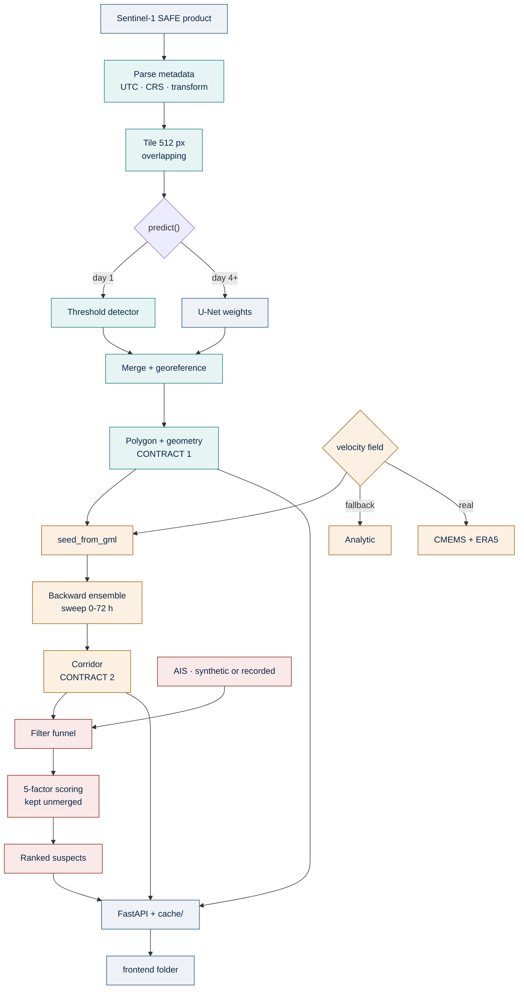

# Backend Workflow — PS 143 SpillTrace

**Scope:** the `backend/` folder only. `ml/` and `frontend/` are separate folders
with separate owners.
**Team:** 3 people — **B1**, **B2**, **B3**.
**Governing rule:** one directory per person. Conflicts are prevented by
ownership, not resolved by merging.

---

## 1. What backend owns, and what it does not

**We own** everything between a raw satellite product and a ranked suspect list,
plus the API that serves it.

**We do not own:**

| Not ours | Whose | Our interface to it |
|---|---|---|
| U-Net training, weights, evaluation | ML | we call `predict(tile) -> probabilities` |
| Map, scrubber, suspect panel, styling | Frontend (2 people) | we publish JSON they consume |

**Two obligations we owe other folders on day 1:**

1. **To frontend** — publish the API shape and mock responses. Two people are
   blocked until they have JSON to build against. This is the single most
   time-critical thing backend does all week.
2. **To ML** — publish `config.py` with the normalisation constants and
   threshold, so training and serving preprocess identically. Skew here is the
   bug where the model works in the notebook and quietly degrades in the API.

---

## 2. Roles

| | Owns | Directory (exclusive) |
|---|---|---|
| **B1** | Ingest & geospatial · geo/time primitives · ML seam | `app/ingest/`, `app/common/` |
| **B2** | Drift & metocean · **+ integration duty** | `app/drift/` |
| **B3** | AIS & attribution · **+ demo cache** | `app/attribution/` |

### B1 — Ingest & Geospatial

- Parse SAFE products with rasterio: UTC acquisition time, orbit, CRS, affine
  transform
- Tile a scene into overlapping 512 px windows; merge predictions back to one
  georeferenced raster
- Mask → polygon vectorisation
- Geometry: area, major/minor axis, **orientation bearing**, centroid lat/lon
- **Threshold fallback detector** (adaptive threshold → contour → largest blob),
  exposing the *same* interface as ML's `predict()`. This is day-1 insurance:
  it unblocks the whole chain before any model exists, and stays in the codebase
  as the classical baseline.
- Owns `app/common/geo.py` and `app/common/timeutil.py` — the primitives B2 and
  B3 import. **Never fork these; ask B1 to extend them.**

### B2 — Drift & Metocean, + integration

- CMEMS and ERA5 readers into OpenDrift
- Analytic fallback field (constant current + linear shear) so drift is never
  blocked on account approval
- `seed_from_gml` from B1's polygon; backward ensemble runs
- Corridor extraction across a swept lookback range
- **Integration duty:** owns `main.py` app assembly, runs the full chain daily,
  reports what broke.

*Why B2 carries integration:* OpenDrift does most of B2's algorithmic heavy
lifting, so B2 has the most spare capacity for cross-cutting plumbing. If that
turns out false in practice, move the duty to whoever is actually least loaded —
but it must be one named person, not "everyone".

### B3 — AIS & Attribution, + demo cache

- Synthetic AIS generator on the NOAA schema (one guilty track + ~15 decoys)
- aisstream collector → PostGIS, timestamp-indexed *(background task; the demo
  does not depend on it — see §8)*
- Filter funnel: all traffic → in time window → intersects corridor → candidates
- Five-factor scoring, **kept unmerged**: proximity, heading vs slick axis,
  trajectory, speed anomaly, transponder gaps
- **Demo cache:** precomputed results for 2–3 scenes written to `cache/`, which
  is what frontend loads at the venue

---

## 3. Directory layout — ownership is the point

```
backend/
├── app/
│   ├── main.py            ⚠️ SHARED · B2 · frozen after day 1
│   ├── contracts.py       ⚠️ SHARED · frozen after day 1 · see §5
│   ├── config.py          ⚠️ SHARED · normalisation, thresholds, paths
│   ├── routers/
│   │   ├── ingest.py         B1 only
│   │   ├── drift.py          B2 only
│   │   └── attribution.py    B3 only
│   ├── ingest/            ── B1, exclusive
│   ├── drift/             ── B2, exclusive
│   ├── attribution/       ── B3, exclusive
│   └── common/
│       ├── geo.py            B1 · CRS, affine, polygon helpers
│       └── timeutil.py       B1 · UTC discipline, parsing
├── mocks/                 all three on day 1, then frozen
├── cache/                 B3 · precomputed demo scenes (gitignored)
├── tests/
│   ├── test_roundtrip.py     B1 · pixel ↔ lat/lon
│   ├── test_contracts.py     B2 · schema conformance
│   └── test_scoring.py       B3
├── requirements.txt       ⚠️ SHARED · append-only, alphabetical
└── .gitignore
```

One router file per person is deliberate: it means three people add endpoints all
week without ever touching the same file.

---

## 4. Git discipline

This is where three people in one folder actually collide. Six rules.

### 4.1 Never commit to `main`

```bash
git switch -c be/b1/parse-safe        # be/<who>/<what>
# ... work, commit, push ...
git push -u origin be/b1/parse-safe
```

PR into `main`, one approval. Review comes from whoever shares an interface with
you: **B1 ↔ B2** (polygon contract), **B2 ↔ B3** (corridor contract).

### 4.2 Commit messages carry the folder and stage

In a shared repo, prefix so `git log` stays readable across all three folders:

```
feat(be/ingest): parse acquisition time from SAFE manifest
fix(be/drift): scale affine transform after downsample
chore(be): pin rasterio to 1.3.9
```

### 4.3 Push daily, even unfinished

The single biggest cause of painful conflicts is a branch that lived for four
days. Push every evening. A messy WIP commit that is visible beats clean work
nobody can see.

### 4.4 Rebase before every PR

```bash
git switch main && git pull
git switch be/b1/parse-safe
git rebase main          # resolve locally, where you understand the code
```

Never force-push a branch someone else is working on.

### 4.5 The four shared files have special rules

| File | Rule |
|---|---|
| `contracts.py` | **Frozen after day 1.** Changes need a dedicated PR + approval from both affected parties. |
| `main.py` | B2 registers all three routers on day 1. Then nobody touches it. |
| `config.py` | Shared constants. Adding a key is fine; changing an existing value needs a heads-up, because ML imports this too. |
| `requirements.txt` | **One dependency per line, alphabetical, pinned.** This makes git auto-merge cleanly instead of conflicting on adjacent lines. |

### 4.6 Never commit data — this repo dies if you do

```gitignore
# .gitignore — data
*.tif
*.tiff
*.npy
*.7z
*.nc
*.zip
*.SAFE/
cache/
data/
*.pt
*.pth
__pycache__/
.env
```

The training collection is ~96 GB and a single SAFE product is several GB. One
accidental commit poisons the repo history permanently and is genuinely painful
to undo. Add this `.gitignore` **before the first commit**, not after.

---

## 5. The three contracts

Frozen day 1. Everything else can change; these cannot without both parties
agreeing.

### Contract 0 — ML → backend

```python
# ml side provides:
predict(tile: ndarray[512, 512, 2]) -> ndarray[512, 512]   # float32 probabilities
# backend applies the threshold, vectorises, georeferences.
# Both sides import normalisation constants from backend/app/config.py.
```

B1's threshold detector implements this same signature, so the chain runs before
ML delivers and swapping in the real model is a one-line change.

### Contract 1 — B1 → B2

```json
{
  "observed_at": "2026-03-14T05:42:11Z",
  "crs": "EPSG:4326",
  "polygon": [[72.61, 18.42], [72.63, 18.44], "..."],
  "area_km2": 12.4,
  "major_axis_km": 8.1,
  "minor_axis_km": 1.9,
  "orientation_deg": 70.2,
  "centroid": [72.62, 18.43],
  "confidence": 0.87,
  "detector": "threshold | unet"
}
```

`observed_at` is load-bearing. Without it there is no way to know how many hours
of drift to undo, and stages B and C cannot run at all.

### Contract 2 — B2 → B3  ⚠️ corrected

**Not a single origin point — a corridor.**

```json
{
  "observed_at": "2026-03-14T05:42:11Z",
  "corridor": [
    {"hours_ago": 6,  "lat": 18.42, "lon": 72.61, "radius_km": 4.2},
    {"hours_ago": 12, "lat": 18.55, "lon": 72.48, "radius_km": 8.1},
    {"hours_ago": 24, "lat": 18.79, "lon": 72.19, "radius_km": 17.6}
  ],
  "field_source": "analytic | cmems_era5"
}
```

A vessel must match in **both** position and time. A ship at the right place but
the wrong lookback is excluded — that joint constraint is far tighter than
either alone, and it is what distinguishes the origin from the sighting. B3
keeps the best-matching `hours_ago` per vessel and reports it as evidence:
*"fits a 26-hour-old discharge."*

Earlier drafts in `PS143_PROJECT_GUIDE.md` §8 and `PS143_WORKFLOW.md` describe
this as a single centroid + radius. **This corridor version supersedes them.**

`field_source` must surface in the UI. Never let a demo imply real ocean data
when the analytic field is running.

---

## 6. Data flow with owners



Teal = B1 · amber = B2 · red = B3 · grey = outside backend.

---

## 7. Day 1 — nothing is real, everything runs

The goal today is that the chain executes end to end on fake data. Then each day
one fake part becomes real, and **the demo never stops working.**

| Who | Day 1 |
|---|---|
| **All three** | Agree `contracts.py` in one sitting. Commit `.gitignore` first. |
| **B2** | Scaffold FastAPI, register three routers, publish mock endpoints. **Tell frontend the URLs by lunch.** Then: register CMEMS + ERA5 (approval has lead time), and **verify OpenDrift's backward-run API** — see §8. |
| **B1** | Download one real SAFE GRD scene. Parse it, print CRS/transform/UTC. Commit the round-trip test. Write the threshold detector. |
| **B3** | Synthetic AIS generator emitting NOAA-schema rows. Start the collector in the background. |

**Gate:** `POST /analyse` returns mock JSON and frontend can fetch it.

### Daily gates

| Day | Gate |
|---|---|
| 2 | Real polygon with orientation replaces the mock |
| 3 | Real corridor + real ranking — no mocks left in the chain |
| 4 | **Integration only, no new features.** Chain runs 3× identically. |
| 5 | U-Net swapped in *if it beats threshold on val*; otherwise keep threshold and say so |
| 6 | Precompute `cache/`, convert float32 → 8-bit PNG, **code freeze** |

Day 4 exists because CRS mismatches, timezone drift and unit confusion only
appear when pieces meet. Budgeting a day for it is cheaper than discovering it
on day 6.

### Daily 15 minutes, standing

1. Does the full chain still run? **B2 demonstrates, not describes.**
2. What is still a mock?
3. What broke since yesterday?

---

## 8. Known risks

- **OpenDrift backward runs are unverified.** The tutorial documents `time_step`
  but says nothing about sign, so I could not confirm that negative steps drive
  a backward run. **B2 checks the API reference or greps the examples on day 1.**
  If it isn't built in, negate the velocity field in a custom reader and run
  forward — same mathematics, more plumbing. Knowing on day 1 rather than day 4
  is the whole point.
- **ERA5 licensing unverified.** CMEMS is confirmed free (*"granted free of
  charge"*, funded to June 2028). ERA5 I could not verify — the CDS domain was
  unreachable. Check the Terms tab at
  `cds.climate.copernicus.eu/datasets/reanalysis-era5-single-levels`. Low
  exposure: OpenDrift reads wind from multiple sources, so NOAA GFS is a config
  swap.
- **CMEMS attribution is mandatory** — *"Generated using E.U. Copernicus Marine
  Service Information"* plus product DOIs, visible where the data is accessed.
  Capture DOIs at download time; put the credit line in the dashboard footer.
- **aisstream is terrestrial**, so a shore station only hears vessels within
  roughly 40–70 nautical miles and open-ocean coverage is thin. Demo near-coast
  on recorded data; state that operational deployment needs satellite AIS.
- **The collector's value is elapsed time, and we have one week.** Start it, but
  the demo uses synthetic AIS. Do not let it eat sprint hours.
- **Three silos, three single points of failure.** Each person writes a one-page
  README in their directory: inputs, outputs, how to run, what's fragile. Pairs
  B1↔B2 and B2↔B3 are backup readers, since they already share interfaces.

---

## 9. Honesty rules for the demo

Non-negotiable, because a technical judge will probe exactly here.

- `detector` and `field_source` are surfaced in the UI. Never let the demo imply
  a trained model or real ocean data when the fallback is running.
- No invented metrics. If training hasn't produced numbers, the answer is "not
  yet measured" — which costs nothing at the idea stage.
- Suspects are **ranked, never accused.** The evidence is probabilistic.
- Synthetic AIS validates pipeline logic and internal consistency only. It is
  **not** real-world ground truth, and must never be described as such.
